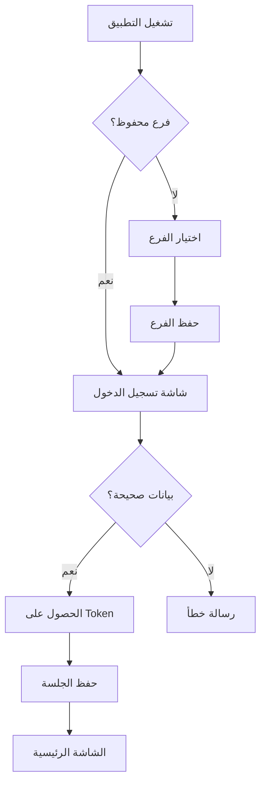

# 📱 تطبيق إدارة المتدربين - Student Application

## 🎯 نظرة عامة على المشروع

تطبيق React Native متكامل لإدارة شؤون المتدربين في مركز طيبة التدريبي، يوفر واجهة موحدة للوصول إلى:
- الجداول الدراسية
- الدرجات والتقييمات
- سجلات الحضور والغياب
- الاختبارات الإلكترونية
- المحتوى التدريبي
- إدارة الطلبات والمعاملات
- المدفوعات والرسوم

---

## 🏗️ البنية المعمارية

### المبادئ المعمارية المطبقة

#### SOLID Principles
التطبيق مبني بشكل احترافي على مبادئ SOLID:

1. **Single Responsibility Principle (SRP)**
   - كل service مسؤول عن مهمة واحدة فقط
   - كل screen مسؤول عن واجهة واحدة
   - كل component له غرض محدد

2. **Open/Closed Principle (OCP)**
   - يمكن إضافة ميزات جديدة دون تعديل الكود الموجود
   - قابل للتوسع عبر الواجهات (Interfaces)

3. **Liskov Substitution Principle (LSP)**
   - استخدام الواجهات والـ abstractions
   - يمكن استبدال التطبيقات بسهولة

4. **Interface Segregation Principle (ISP)**
   - واجهات محددة لكل غرض
   - عدم إجبار المكونات على تطبيق واجهات لا تحتاجها

5. **Dependency Inversion Principle (DIP)**
   - الاعتماد على الـ abstractions وليس التطبيقات المحددة
   - استخدام Interfaces للخدمات

---

## 🔧 التقنيات المستخدمة

### Frontend Framework
- **React Native 0.81.4** - إطار العمل الرئيسي
- **React 19.1.0** - مكتبة React الأساسية
- **TypeScript 5.8.3** - للكتابة الآمنة والقوية

### Navigation
- **@react-navigation/native 6.1.9**
- **@react-navigation/native-stack 6.9.17**
- **@react-navigation/drawer 6.6.6**

### State Management & Storage
- **@react-native-async-storage/async-storage 1.21.0** - للتخزين المحلي

### UI Components
- **react-native-safe-area-context 5.5.2**
- **react-native-screens 3.29.0**
- **react-native-gesture-handler 2.14.1**
- **react-native-reanimated 3.6.1** - للرسوم المتحركة

### Testing
- **Jest 29.6.3** - إطار الاختبار
- **@types/jest 29.5.13**

---

## 📂 هيكل المجلدات

```
src/
├── components/           # المكونات القابلة لإعادة الاستخدام
│   ├── BottomNavigationBar.tsx
│   ├── CustomButton.tsx
│   ├── CustomInput.tsx
│   ├── DailySchedule.tsx
│   ├── DatePicker.tsx
│   ├── GradientBackground.tsx
│   ├── Logo.tsx
│   ├── RightDrawerMenu.tsx
│   ├── ScheduleSessionItem.tsx
│   ├── ScheduleSlotDetails.tsx
│   ├── TopNavigationBar.tsx
│   ├── WeeklyScheduleView.tsx
│   └── grades/
│       ├── ClassroomCard.tsx
│       ├── ContentCard.tsx
│       └── OverallStatsCard.tsx
│
├── screens/              # شاشات التطبيق
│   ├── LoginScreen.tsx
│   ├── SignupScreen.tsx
│   ├── BranchSelectionScreen.tsx
│   ├── HomeScreen.tsx
│   ├── ProfileScreen.tsx
│   ├── ScheduleScreen.tsx
│   ├── GradesScreen.tsx
│   ├── AttendanceScreen.tsx
│   ├── ExamsScreen.tsx
│   ├── DocumentsScreen.tsx
│   ├── PaymentsScreen.tsx
│   ├── PaymentDueDatesScreen.tsx
│   ├── TrainingContentsScreen.tsx
│   ├── RequestsHubScreen.tsx
│   ├── StudentRequestsScreen.tsx
│   ├── PaymentDeferralRequestsScreen.tsx
│   ├── CreatePaymentDeferralScreen.tsx
│   ├── ExamPostponementScreen.tsx
│   ├── SickLeaveScreen.tsx
│   ├── EnrollmentProofScreen.tsx
│   ├── CertificateScreen.tsx
│   └── RequestSettingsScreen.tsx
│
├── services/             # خدمات الـ API
│   ├── apiConfig.ts
│   ├── authService.ts
│   ├── branchService.ts
│   ├── gradesService.ts
│   ├── attendanceService.ts
│   ├── quizService.ts
│   ├── requestsService.ts
│   └── trainingContentsService.ts
│
├── types/                # تعريفات TypeScript
│   ├── auth.ts
│   ├── grades.ts
│   ├── attendance.ts
│   ├── exams.ts
│   ├── requests.ts
│   ├── quizzes.ts
│   ├── trainingContents.ts
│   └── components.ts
│
├── interfaces/           # الواجهات البرمجية
│   ├── IGradesService.ts
│   └── IRequestsService.ts
│
├── hooks/                # Custom React Hooks
│   ├── useGrades.ts
│   └── useGradesUI.ts
│
├── utils/                # دوال مساعدة
│   └── gradesUtils.ts
│
├── styles/               # ملفات الأنماط
│   ├── colors.ts
│   ├── spacing.ts
│   ├── theme.ts
│   └── typography.ts
│
└── navigation/           # إعدادات التنقل
    └── AppNavigator.tsx
```

---

## 🎨 نظام التصميم (Design System)

### نظام الألوان
```typescript
Primary Colors:
- primary: '#2563EB' (أزرق نابض بالحياة)
- primaryLight: '#3B82F6'
- primaryDark: '#1E3A8A'
- primarySoft: 'rgba(59, 130, 246, 0.08)'

Secondary Colors:
- secondary: '#F59E0B' (كهرماني دافئ)
- accent: '#10B981' (أخضر زمردي)

Status Colors:
- success: '#06B6D4'
- error: '#EF4444'
- warning: '#F59E0B'
- info: '#2563EB'

Background:
- background: '#F6F9FF'
- white: '#FFFFFF'
- cardBackground: '#FFFFFF'
```

### المكونات القابلة لإعادة الاستخدام
- **CustomButton**: أزرار مخصصة بأنواع متعددة
- **CustomInput**: حقول إدخال مع التحقق من الصحة
- **GradientBackground**: خلفيات متدرجة
- **Logo**: شعار التطبيق
- **TopNavigationBar**: شريط التنقل العلوي
- **BottomNavigationBar**: شريط التنقل السفلي

---

## 🌟 الميزات الرئيسية

### 1. إدارة الفروع (Branch Management)
```typescript
// فروع متعددة
- المنصورة: https://mansapi.tiba29.com
- الزقازيق: https://zagapi.tiba29.com

// مزايا:
✓ اختيار الفرع عند أول استخدام
✓ حفظ اختيار الفرع محلياً
✓ إمكانية تغيير الفرع
✓ تحديث URL تلقائياً
```

### 2. المصادقة والأمان (Authentication)
```typescript
Features:
✓ تسجيل الدخول بالرقم القومي وكلمة المرور
✓ إنشاء حساب جديد (Sign Up)
✓ التحقق من بيانات المتدرب
✓ التحقق من رقم الهاتف
✓ إعادة تعيين كلمة المرور
✓ حفظ الجلسة محلياً (AsyncStorage)
✓ Bearer Token Authentication
```

### 3. الجدول الدراسي (Schedule Management)
```typescript
Features:
✓ عرض الجدول الأسبوعي الكامل
✓ عرض جدول يومي مفصل
✓ تفاصيل كل حصة دراسية
✓ معلومات المدرب
✓ القاعات الدراسية
✓ حالة المحاضرات (ملغاة/نشطة)
✓ التبديل بين العرض الأسبوعي واليومي

Components:
- WeeklyScheduleView: عرض أسبوعي
- DailySchedule: عرض يومي
- ScheduleSlotDetails: تفاصيل الحصة
- ScheduleSessionItem: عنصر جلسة واحدة
```

### 4. الدرجات والتقييمات (Grades & Assessments)
```typescript
Features:
✓ عرض الدرجات الإجمالية
✓ تفصيل الدرجات حسب المادة
✓ تفصيل الدرجات حسب الفصل
✓ أنواع متعددة من الدرجات:
  - أعمال السنة (Year Work)
  - العملي (Practical)
  - التحريري (Written)
  - الحضور (Attendance)
  - اختبارات مصغرة (Quizzes)
  - الميد تيرم (Final Exam)
✓ النسب المئوية والتقديرات
✓ إحصائيات مفصلة

UI Features:
- واجهة تفاعلية قابلة للطي/الفتح
- رسوم بيانية للتقدم
- ألوان تعبيرية حسب الأداء
- بطاقات تفاعلية
```

### 5. الحضور والغياب (Attendance)
```typescript
Features:
✓ سجل الحضور الكامل
✓ تصنيف حسب المادة
✓ حالات الحضور:
  - حاضر (Present)
  - غائب (Absent)
  - متأخر (Late)
  - بعذر (Excused)
✓ إحصائيات الحضور
✓ نسبة الحضور الإجمالية
✓ تفاصيل كل جلسة
✓ فلترة حسب الحالة

Statistics:
- إجمالي الجلسات
- عدد مرات الحضور
- نسبة الحضور المئوية
- التقييم العام
```

### 6. الاختبارات الإلكترونية (Electronic Exams)
```typescript
Features:
✓ عرض الاختبارات المتاحة
✓ حالات متعددة للاختبارات:
  - متاح الآن (Available)
  - مكتمل (Completed)
  - قريباً (Upcoming)
  - منتهي (Ended)
✓ تفاصيل كل اختبار:
  - المدة الزمنية
  - عدد الأسئلة
  - درجة النجاح
  - تاريخ البدء والانتهاء
✓ نظام الأسئلة:
  - أسئلة اختيار من متعدد
  - صور مرفقة (اختياري)
  - نقاط لكل سؤال
  - حفظ تلقائي للإجابات
✓ شاشة النتائج:
  - الدرجة الكاملة
  - النسبة المئوية
  - حالة النجاح/الرسوب
  - الوقت المستغرق
✓ واجهة مستخدم احترافية:
  - شريط تقدم
  - تنقل بين الأسئلة
  - تأكيد قبل التسليم
```

### 7. المحتوى التدريبي (Training Content)
```typescript
Features:
✓ عرض المواد الدراسية
✓ محتوى كل مادة
✓ تفاصيل المقررات
```

### 8. إدارة الطلبات (Requests Management)
```typescript
Types:
1. طلبات تأجيل السداد (Payment Deferral)
   - إنشاء طلب جديد
   - عرض الطلبات السابقة
   - حالات: قيد المراجعة، مقبول، مرفوض

2. طلبات المتدرب المجانية:
   - تأجيل اختبار (Exam Postponement)
   - إجازة مرضية (Sick Leave)
   - إثبات قيد (Enrollment Proof)
   - إفادة (Certificate)

Features:
✓ إنشاء طلب جديد
✓ رفع مرفقات
✓ تتبع حالة الطلب
✓ رد الإدارة
✓ إعدادات الطلبات
```

### 9. المدفوعات (Payments)
```typescript
Features:
✓ عرض الرسوم المستحقة
✓ تواريخ الاستحقاق
✓ حالة السداد
✓ المبالغ المدفوعة
✓ المبالغ المتبقية
```

### 10. المستندات (Documents)
```typescript
Features:
✓ عرض المستندات المطلوبة
✓ رفع المستندات
✓ حالة التحقق
```

---

## 🔐 نظام المصادقة والتفويض

### Authentication Flow


### API Configuration
```typescript
// Multi-Branch Support
BASE_URL: dynamic (يتغير حسب الفرع)
Branches:
  - Mansoura: https://mansapi.tiba29.com
  - Zagazig: https://zagapi.tiba29.com

// Authentication Headers
Authorization: Bearer {accessToken}
Content-Type: application/json
Accept: application/json

// Timeout
TIMEOUT: 10000ms (10 seconds)
```

---

## 📊 نظام إدارة الحالة (State Management)

### State Management Strategy
```typescript
// Local Component State
- useState للحالة المحلية
- useEffect للعمليات الجانبية
- useRef للقيم المستمرة

// Global State
- AppNavigator يدير:
  * حالة المصادقة
  * معلومات المستخدم
  * الشاشة الحالية
  * الفرع المختار

// Persistent State
- AsyncStorage للبيانات المستمرة:
  * Access Token
  * معلومات المستخدم
  * الفرع المختار
  * إعدادات التطبيق
```

---

## 🎭 الرسوم المتحركة (Animations)

### Animation Libraries
- **react-native-reanimated 3.6.1** - للرسوم المتحركة المعقدة
- **Animated API** - من React Native

### Animation Patterns
```typescript
// Fade In Animation
fadeAnim = useRef(new Animated.Value(0))
Animated.timing(fadeAnim, {
  toValue: 1,
  duration: 600,
  useNativeDriver: true,
})

// Slide Animation
slideAnim = useRef(new Animated.Value(30))
Animated.timing(slideAnim, {
  toValue: 0,
  duration: 600,
  useNativeDriver: true,
})

// Scale Animation
scaleAnim = useRef(new Animated.Value(0.95))
Animated.spring(scaleAnim, {
  toValue: 1,
  tension: 100,
  friction: 8,
  useNativeDriver: true,
})
```

---

## 🧪 الاختبارات (Testing)

### Testing Framework
- **Jest 29.6.3**
- **React Test Renderer 19.1.0**

### Test Files
```
__tests__/
├── App.test.tsx
└── SignupScreen.test.tsx
```

---

## 🚀 نقاط القوة

### 1. البنية المعمارية
✅ تطبيق مبادئ SOLID بشكل احترافي
✅ فصل واضح بين الطبقات (Separation of Concerns)
✅ استخدام TypeScript للكتابة القوية
✅ استخدام Interfaces للتجريد
✅ قابلية التوسع العالية

### 2. تجربة المستخدم (UX)
✅ واجهة مستخدم حديثة وجذابة
✅ رسوم متحركة سلسة
✅ تصميم متجاوب
✅ دعم اللغة العربية الكامل (RTL)
✅ رسائل خطأ واضحة ومفيدة

### 3. الأداء (Performance)
✅ استخدام useNativeDriver للرسوم المتحركة
✅ تحميل البيانات بشكل فعال
✅ Lazy Loading للمكونات
✅ Optimized re-renders

### 4. الأمان (Security)
✅ Bearer Token Authentication
✅ حفظ آمن للبيانات في AsyncStorage
✅ HTTPS للاتصال بالـ API
✅ Validation على المدخلات

### 5. قابلية الصيانة (Maintainability)
✅ كود نظيف ومنظم
✅ تعليقات واضحة
✅ استخدام TypeScript
✅ نمط تسمية موحد
✅ فصل المنطق عن العرض

---

## 🔧 نقاط التحسين المحتملة

### 1. إدارة الحالة
```typescript
// الحالي: Component State + Props Drilling
// مقترح: State Management Library
Options:
- Redux Toolkit (للتطبيقات الكبيرة)
- Zustand (خفيف وبسيط)
- React Query (لإدارة Server State)
- Context API + useReducer (للحالات المتوسطة)
```

### 2. التخزين المحلي
```typescript
// الحالي: AsyncStorage
// مقترح: إضافة طبقة تشفير
Options:
- react-native-encrypted-storage
- Secure Storage
```

### 3. معالجة الأخطاء
```typescript
// مقترح: Error Boundary
- إضافة Error Boundary Components
- Centralized Error Handling
- Error Reporting Service (Sentry)
```

### 4. التحسينات الأمنية
```typescript
Improvements:
✓ Token Refresh Mechanism
✓ Session Timeout
✓ Biometric Authentication (Face ID / Touch ID)
✓ PIN Code Protection
✓ Certificate Pinning
```

### 5. الاختبارات
```typescript
// مقترح: تحسين التغطية
Current: Limited test coverage
Improvements:
- Unit Tests (Services, Utils)
- Integration Tests (Screens)
- E2E Tests (User Flows)
- Snapshot Tests (Components)
Target: 80%+ code coverage
```

### 6. الأداء
```typescript
Optimizations:
✓ Image Optimization & Caching
✓ List Virtualization (FlatList optimization)
✓ Memoization (React.memo, useMemo, useCallback)
✓ Code Splitting
✓ Bundle Size Optimization
```

### 7. التوثيق
```typescript
Improvements:
✓ API Documentation (Swagger/OpenAPI)
✓ Component Documentation (Storybook)
✓ Inline Code Documentation (JSDoc)
✓ Architecture Decision Records (ADR)
```

### 8. CI/CD
```typescript
Setup:
✓ Automated Testing
✓ Code Quality Checks (ESLint, Prettier)
✓ Automated Builds
✓ Automated Deployments
✓ Version Management
```

### 9. Monitoring & Analytics
```typescript
Tools:
✓ Crash Reporting (Crashlytics)
✓ Performance Monitoring (Firebase Performance)
✓ User Analytics (Firebase Analytics)
✓ Error Tracking (Sentry)
```

### 10. Offline Support
```typescript
Features:
✓ Offline Data Caching
✓ Sync When Online
✓ Offline Indicators
✓ Queue for Network Requests
```

---

## 📱 متطلبات التشغيل

### Development Environment
```bash
Node.js: >= 20
React Native CLI: latest
Android Studio (للأندرويد)
Xcode (للـ iOS)
```

### Dependencies Installation
```bash
# Install dependencies
npm install

# Install iOS Pods (Mac only)
cd ios && bundle install && bundle exec pod install
```

### Running the App
```bash
# Android
npm run android

# iOS
npm run ios

# Start Metro
npm start
```

### Building
```bash
# Android Release Build
npm run build:android
```

---

## 🎯 الخلاصة

تطبيق Student Application هو تطبيق احترافي مبني بشكل ممتاز على:
- **مبادئ SOLID** للبنية المعمارية القوية
- **TypeScript** للكتابة الآمنة
- **React Native** للأداء العالي
- **تصميم حديث** لتجربة مستخدم ممتازة
- **قابلية التوسع** للميزات المستقبلية

التطبيق جاهز للاستخدام وقابل للتطوير والتحسين المستمر.

---

## 📚 المراجع

- [React Native Documentation](https://reactnative.dev/)
- [TypeScript Handbook](https://www.typescriptlang.org/docs/)
- [React Navigation](https://reactnavigation.org/)
- [SOLID Principles](https://en.wikipedia.org/wiki/SOLID)

---

**تاريخ التوثيق:** 2025-11-26
**الإصدار:** 0.0.1
**المؤلف:** Roo AI Architect