# 📊 المخططات المعمارية - Student Application

## 📋 جدول المحتويات

1. [البنية المعمارية العامة](#البنية-المعمارية-العامة)
2. [معمارية الطبقات](#معمارية-الطبقات)
3. [تدفق المصادقة](#تدفق-المصادقة)
4. [معمارية الخدمات](#معمارية-الخدمات)
5. [تدفق البيانات](#تدفق-البيانات)
6. [بنية المكونات](#بنية-المكونات)
7. [تدفق التنقل](#تدفق-التنقل)

---

## 🏛️ البنية المعمارية العامة

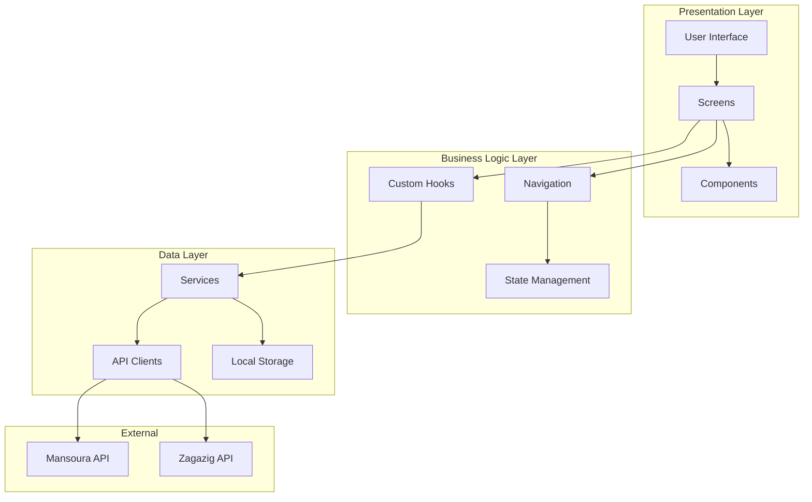

---

## 📚 معمارية الطبقات

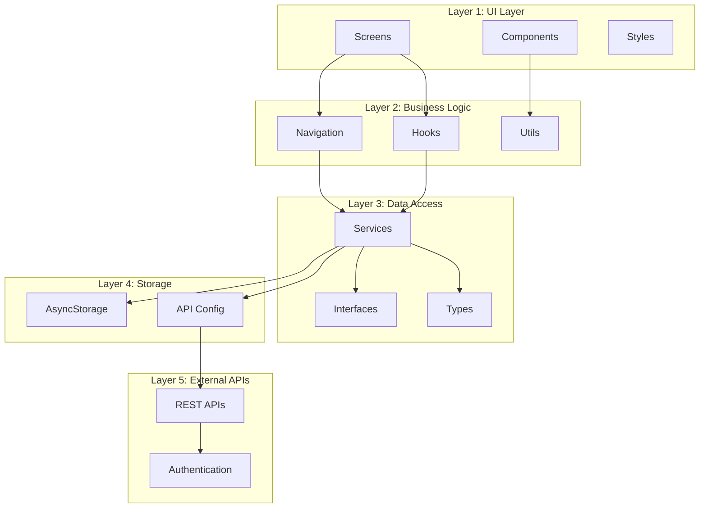

---

## 🔐 تدفق المصادقة

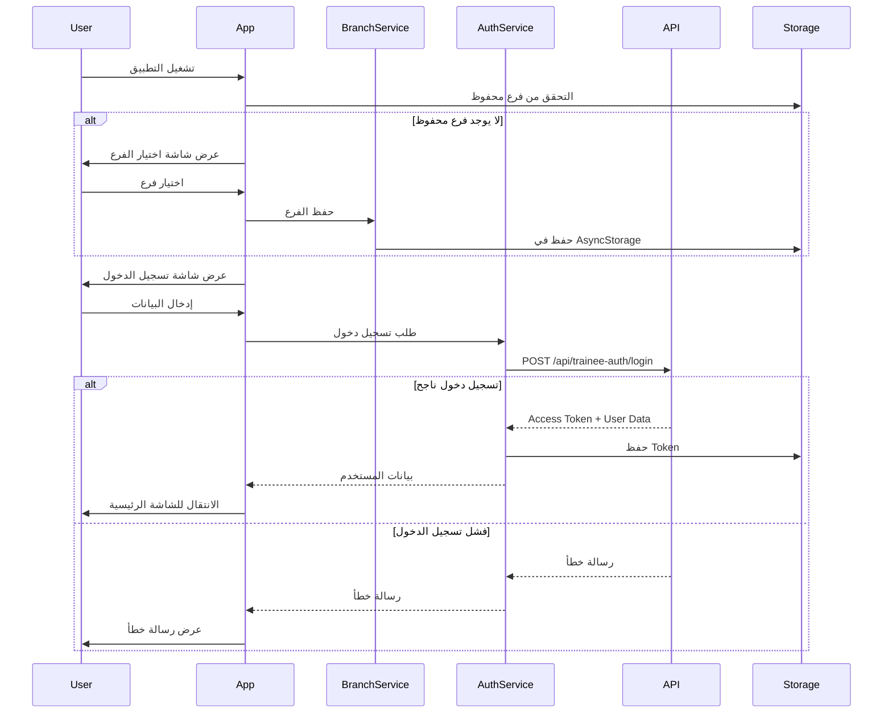

---

## 🔧 معمارية الخدمات

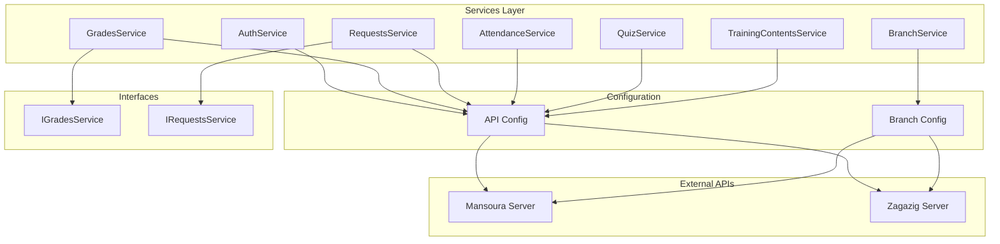

---

## 💾 تدفق البيانات - عرض الدرجات

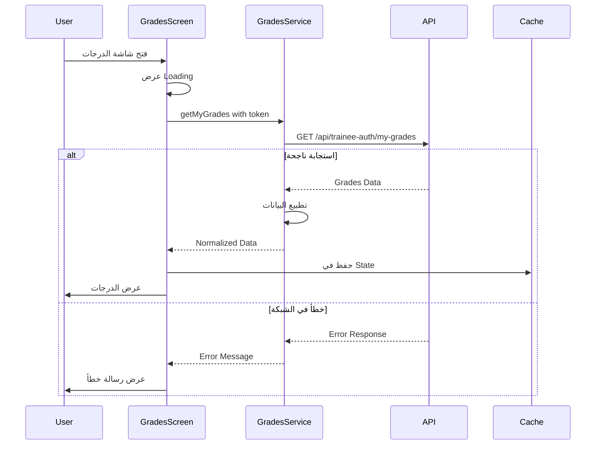

---

## 🎨 بنية المكونات

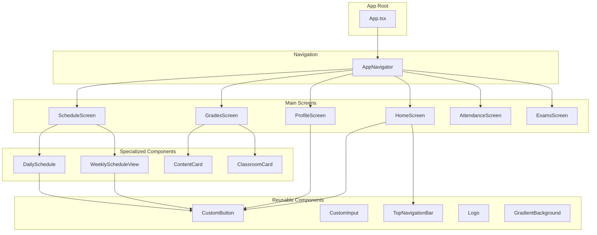

---

## 🧭 تدفق التنقل

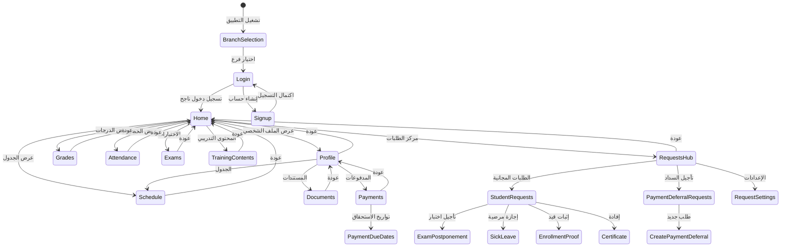

---

## 🔄 دورة حياة الطلب

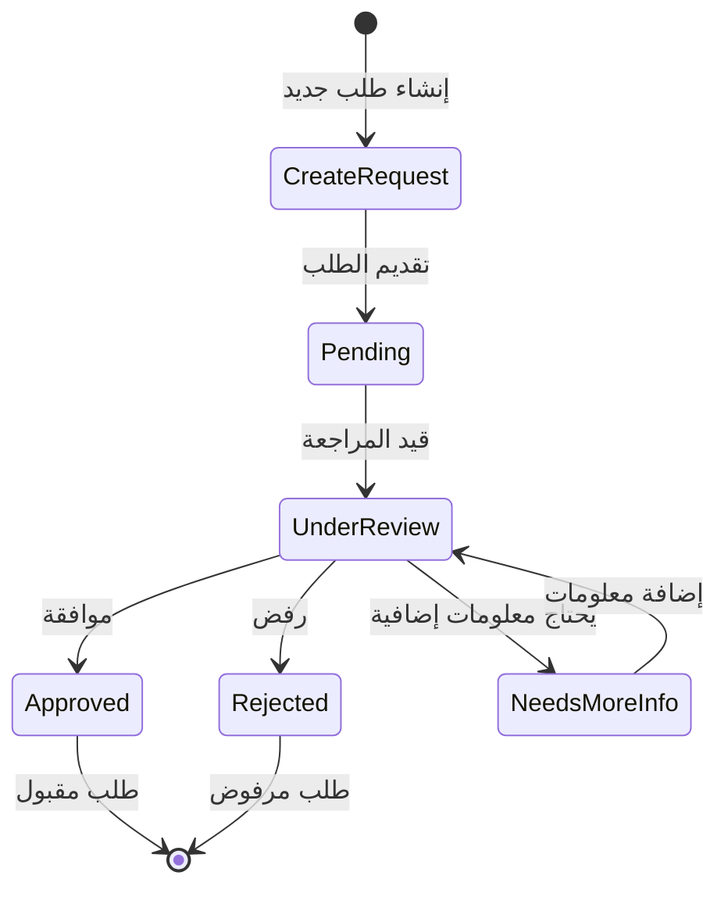

---

## 📱 معمارية الشاشات

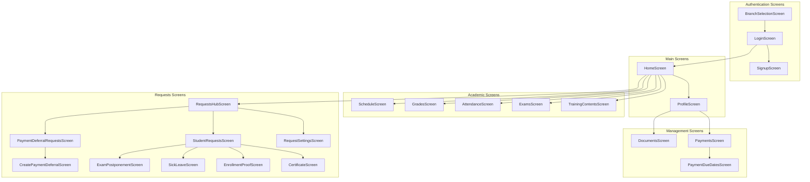

---

## 🔄 تدفق عمل الاختبار الإلكتروني

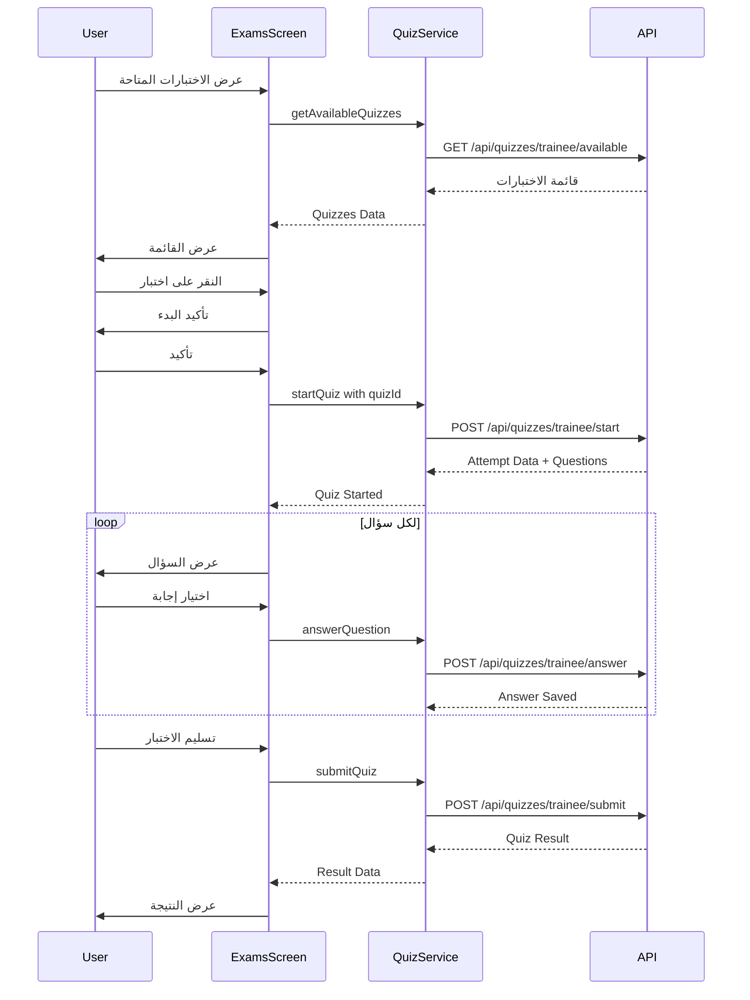

---

## 💾 معمارية التخزين المحلي

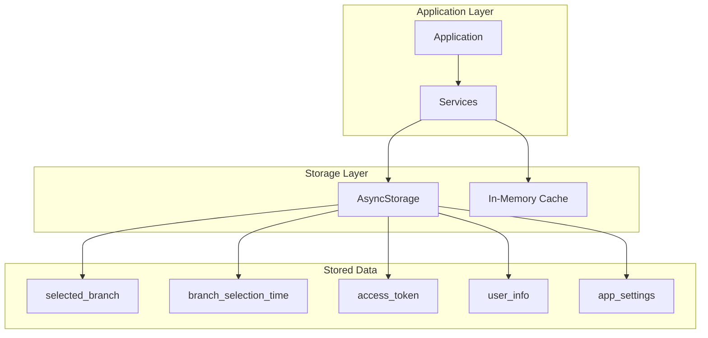

---

## 🎯 معمارية الخطأ والمعالجة

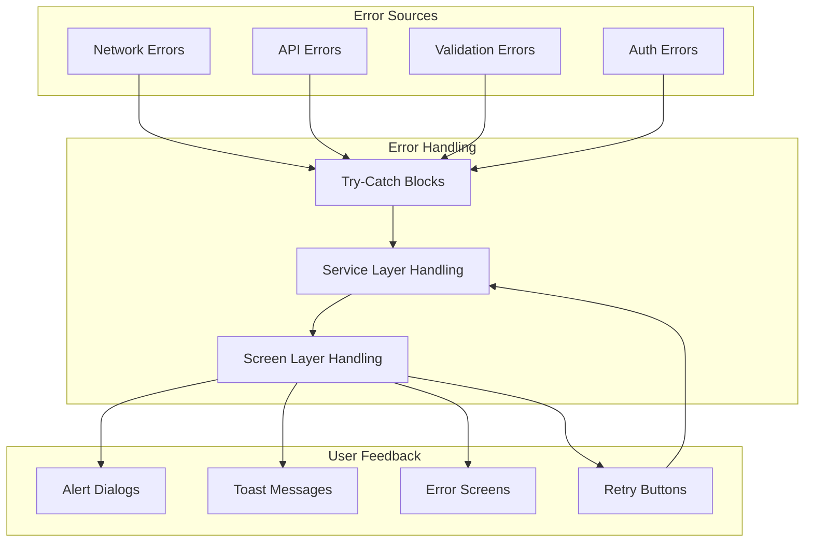

---

## 📊 نموذج البيانات - الدرجات

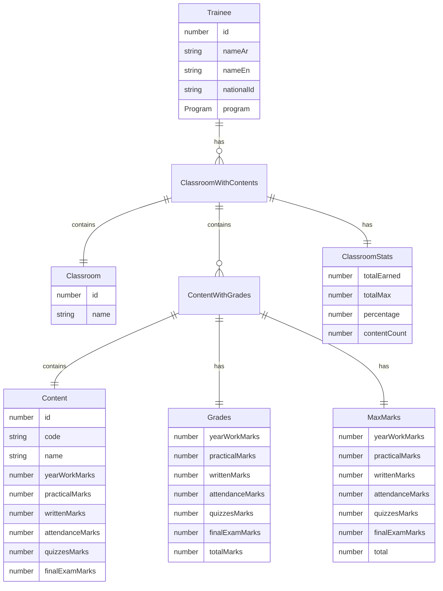

---

## 🏗️ معمارية الطبقات - SOLID

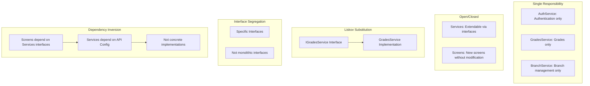

---

## 🎭 معمارية الرسوم المتحركة

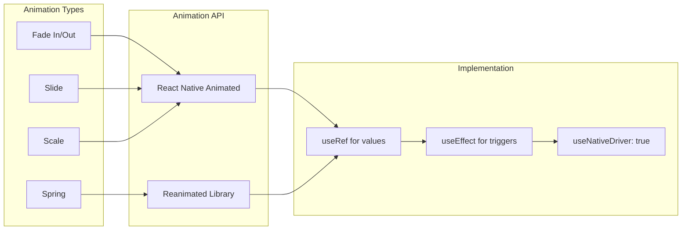

---

## 🌐 معمارية الشبكة

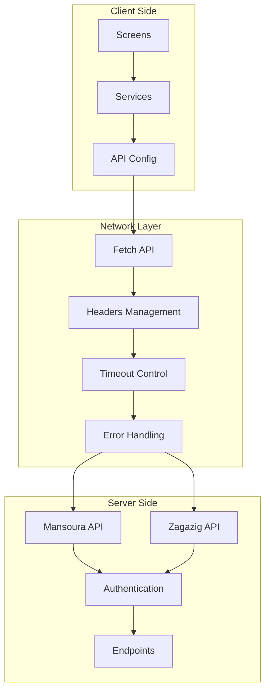

---

**تاريخ الإنشاء:** 2025-11-26  
**الإصدار:** 1.0  
**المؤلف:** Roo AI Architect